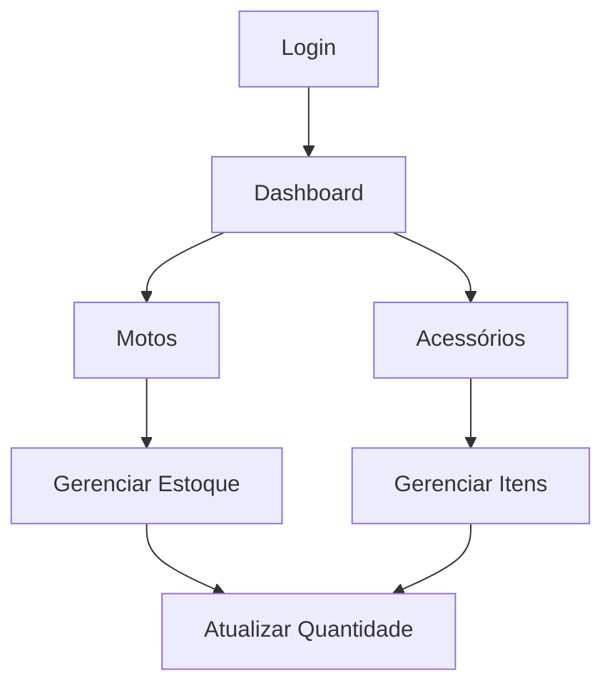

# 🏍️ Stock Moto

  
  
  
  

  <b>Aplicativo mobile para gerenciamento de estoque de motos e acessórios</b> 
  Simples, intuitivo e focado em produtividade 📦

---

🔗 **Protótipo interativo:**
https://www.figma.com/proto/8mc9326n5v5aGeKzwOPnt0/APP-STOCK-MOTO

---

## 🧠 Sobre o projeto

O **Stock Moto** foi criado para resolver problemas comuns de controle de estoque em oficinas e lojas de motocicletas.

Com uma interface moderna e intuitiva, o app permite:

* Organizar produtos
* Controlar quantidades
* Visualizar estoque rapidamente
* Gerenciar acessórios

---

## ✨ Funcionalidades

### 🔐 Autenticação

* Login
* Criar conta
* Recuperação de senha

### 🏠 Dashboard

* Acesso rápido às categorias
* Navegação simples e direta

### 📦 Estoque de Motos

* Separação por marcas:

  * Honda
  * Yamaha
  * Shineray
* Controle de quantidade
* Atualização em tempo real

### 🛠️ Acessórios

* Categorias:

  * Capacetes
  * Baús
  * Redes
  * Kits
* Gestão individual de itens

### ➕ Cadastro

* Criação de novos produtos
* Formulários completos

### ⚠️ Alertas

* Estoque baixo
* Indicadores visuais

### 👤 Perfil & ⚙️ Configurações

* Dados do usuário
* Preferências do sistema

---

## 🧩 Fluxo do App

---

## 🎨 Design

* 🌙 Tema escuro moderno
* 🟧 Destaque em laranja
* 📱 Mobile-first
* 🔄 Navegação intuitiva
* 🧩 Componentização

---

## 🛠️ Tecnologias

> (planejadas para desenvolvimento)

* React Native
* Firebase
* Figma (UI/UX)

---

## 📌 Status

🚧 Projeto em fase de prototipação

---

## 🚀 Roadmap

* [ ] Transformar design em código
* [ ] Criar API de produtos
* [ ] Implementar autenticação real
* [ ] Notificações de estoque
* [ ] Relatórios avançados

---

